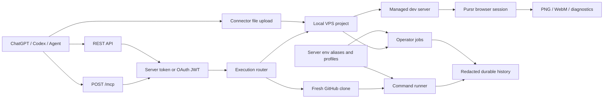

# Purr Verify MCP

<p align="center">
  
</p>

<p align="center">
  <strong>Private verification and operator control plane for coding agents.</strong>
</p>

<p align="center">
  
  
  
  
  
  <a href="https://github.com/0xheycat/Purr-Verify-MCP/stargazers"></a>
  
</p>

Purr Verify MCP gives agents a real runtime: fresh GitHub clone verification, exact local working-tree verification, private VPS project inspection, server-owned environment profiles, durable logs, and deployment-oriented operator jobs.

It is built for a private single-owner setup where the tool should remove friction, not create ceremony. Secrets stay server-side, logs stay redacted, and long-running verification is a first-class workflow.

---

## Current Capabilities

- ChatGPT-compatible MCP endpoint at `/mcp`.
- OAuth metadata and resource-bound access tokens for connector use.
- REST API for health, job creation, job status, streaming, sharing, and cancellation.
- Fresh repository verification from `https://github.com/<owner>/<repo>.git`.
- Exact local project inspection and verification on the VPS.
- Opaque binary connector-file upload to absolute server paths with streaming SHA-256 verification and atomic replacement.
- Managed `npm run dev`-style work sessions paired with persistent Pursr browser state.
- Browser snapshots, actions, direct-to-model PNG evidence, element inspection, diagnostics, and optional WebM recording.
- Project discovery across common private VPS roots.
- Runtime inspection for PM2, systemd, Docker Compose, and matching processes.
- Environment inventory from dotenv, PM2, systemd, Compose, and process env.
- Server-side environment aliases with `@server:<alias>`.
- Server-owned environment profiles selected by public label.
- Durable job history with SQLite WAL.
- Async routing for heavy work and long-running fork/soak/smoke verification.
- Private-friendly timeout defaults with configurable caps.
- Redacted logs, redacted job records, and temporary share links.

---

## Architecture



Core principle: the client sends intent and safe public selectors; the server owns credentials, runtime paths, timeout policy, and durable evidence.

---

## Quickstart

```bash
git clone https://github.com/0xheycat/Purr-Verify-MCP.git
cd Purr-Verify-MCP
cp .env.example .env
bun install --frozen-lockfile
bun run dev
```

Health:

```bash
curl http://localhost:3000/api/health
```

MCP endpoint:

```text
http://localhost:3000/mcp
```

Production endpoint:

```text
https://verify.yourdomain.com/mcp
```

---

## Production Environment

Minimum single-owner production shape:

```bash
NODE_ENV=production
PUBLIC_BASE_URL=https://verify.yourdomain.com

AUTH_MODE=server_token
VERIFY_TOKEN=
GITHUB_TOKEN=
ALLOW_ALL_REPOS=true

OAUTH_ISSUER=https://verify.yourdomain.com
OAUTH_RESOURCE_URL=https://verify.yourdomain.com/mcp
OAUTH_OWNER_CODE=
OAUTH_PRIVATE_KEY=
OAUTH_ACTIVE_KEY_ID=prod-ed25519-2026-07
OAUTH_CLIENT_ID=chatgpt-purr-verify
OAUTH_SCOPES_SUPPORTED=verify:read verify:run verify:share
OAUTH_TOKEN_TTL_SECONDS=6048000
OAUTH_REFRESH_TOKEN_TTL_SECONDS=2592000
OAUTH_SUBJECT=0xheycat
OAUTH_STORAGE_MODE=json

VERIFY_DATA_DIR=/var/lib/purr-verify/data
WORKDIR_BASE=/var/lib/purr-verify/workspaces
TOOLCHAIN_CACHE_DIR=/var/lib/purr-verify/toolchains

MAX_CONCURRENT_JOBS=1
COMMAND_TIMEOUT_MS=600000
JOB_TIMEOUT_MS=1800000
MAX_LONG_RUN_TIMEOUT_MS=31536000000
MAX_LOG_BYTES=500000
CLEANUP_AFTER_MS=3600000
```

Private operator defaults are intentionally broad. You can still narrow them with env if you want stricter behavior later.

---

## Server Environment Aliases

Use aliases when a job needs a secret or private runtime value but the client should not send the value.

```bash
# Format: <alias>=<server environment key>, comma-separated
VERIFY_SERVER_ENV_REF_ALLOWLIST=runtime_credential=VERIFY_RUNTIME_CREDENTIAL,runtime_rpc_url=VERIFY_RUNTIME_RPC_URL
VERIFY_RUNTIME_CREDENTIAL=
VERIFY_RUNTIME_RPC_URL=
```

Client request:

```json
{
  "env": {
    "RUNTIME_API_KEY": "@server:runtime_api_key"
  }
}
```

The resolved value exists only in runtime memory. Alias source keys and resolved values are not returned by discovery, job records, logs, snapshots, or share links.

---

## Server Environment Profiles

Profiles group runtime configuration behind one public label. This is the preferred workflow for repeatable private verification.

```bash
VERIFY_SERVER_ENV_PROFILES='{
  "shared_node_ci": {
    "NODE_ENV": "test",
    "CI": "true"
  },
  "purrliquid_fork_smoke": {
    "PURR_ENV": "fork",
    "PURR_LLM_ENABLED": "true",
    "PURR_LLM_PROVIDER": "custom",
    "PURR_RUNTIME_API_KEY": "@server:runtime_api_key",
    "SOLANA_FORK_RPC": "@server:runtime_rpc_url"
  }
}'
```

Client request:

```json
{
  "env": {
    "VERIFY_SERVER_ENV_PROFILE": "shared_node_ci"
  }
}
```

The profile selector is consumed before execution and does not reach the child process. Explicit env values can be supplied beside a profile as long as they do not conflict with profile-owned keys.

Discovery tool:

```text
purr_list_server_env_profiles
```

It returns only profile labels and safe diagnostics. Environment keys and values are omitted.

---

## MCP Tools

High-level groups:

| Group | Tools |
|---|---|
| Operating guide | `read_operating_guide`, `health_check`, `list_allowed_commands` |
| Repository verification | `create_verification_job`, `get_verification_job`, `list_verification_jobs`, `cancel_verification_job` |
| History and logs | `search_verification_history`, `get_latest_verification`, `get_verification_summary`, `compare_verification_jobs`, `get_job_log_chunk`, `search_job_logs` |
| Sharing | `create_share_link`, `list_share_links`, `revoke_share_links` |
| Private project inspection | `purr_discover_projects`, `purr_inspect_project`, `purr_inspect_runtime`, `purr_inspect_environment`, `purr_plan_deployment` |
| Private operator jobs | `purr_run_command`, `purr_verify_project`, `purr_create_deploy_snapshot`, `purr_deploy_project`, `purr_restart_service`, `purr_check_health`, `purr_rollback_deployment`, `purr_get_job_status`, `purr_get_job_logs`, `purr_cancel_job` |
| Binary file transfer | `purr_upload_file` |
| Pursr browser work | `purr_browser_doctor`, `purr_work_session_start`, `purr_work_sessions`, `purr_work_session_status`, `purr_work_session_snapshot`, `purr_work_session_act`, `purr_work_session_screenshot`, `purr_work_session_inspect`, `purr_work_session_diagnostics`, `purr_work_session_close` |
| Server env discovery | `purr_list_server_env_aliases`, `purr_list_server_env_profiles` |

---

## Example: Fresh Clone Verification

```json
{
  "repo": "0xheycat/Purr-Verify-MCP",
  "ref": "main",
  "expected_head": "8fd9e81108affba094a0bdadfd86287f97b0372c",
  "mode": "async",
  "commands": [
    "bun install --frozen-lockfile",
    "bun test --isolate --timeout 20000",
    "bun run typecheck",
    "bun run lint",
    "bun run build"
  ],
  "env": {
    "VERIFY_SERVER_ENV_PROFILE": "shared_node_ci"
  }
}
```

---

## Example: Local VPS Project Verification

```json
{
  "cwd": "/root/purr-verify",
  "verifyCommands": [
    "bun test --isolate --timeout 20000",
    "bun run build"
  ],
  "environmentOverrides": {
    "VERIFY_SERVER_ENV_PROFILE": "shared_node_ci"
  }
}
```

For generic local commands, prefer argv:

```json
{
  "cwd": "/root/purr-verify",
  "argv": ["bun", "test", "--isolate", "--timeout", "20000"],
  "timeoutMs": 7200000
}
```

Timeout overrides automatically opt into long-run handling. You do not need to remember a separate flag.

---

## Example: Binary Connector File Upload

Attach any file in ChatGPT, calculate or provide its expected SHA-256, then call:

```json
{
  "file": "<local connector file>",
  "destination": "/opt/example/artifacts/model.bin",
  "sha256": "0123456789abcdef0123456789abcdef0123456789abcdef0123456789abcdef"
}
```

`purr_upload_file` treats the input as opaque bytes. It does not restrict extension, MIME type, or file size at the application layer. The transfer is streamed with backpressure, parent directories are created, and an existing destination is atomically replaced only after the complete SHA-256 matches. A mismatch removes the temporary file and leaves the previous destination unchanged.

The actual maximum transferable size is therefore determined by available disk space, filesystem support, connector availability, and surrounding network or platform infrastructure rather than a Verify MCP byte cap.

---

## Example: Browser Work Session

First inspect browser readiness:

```text
purr_browser_doctor
```

Then start the project's real dev command and attach Pursr:

```json
{
  "cwd": "/opt/Heycatlab",
  "sessionId": "heycatlab-ui",
  "argv": ["npm", "run", "dev"],
  "port": 3000,
  "browserMode": "headless",
  "browserRequired": false
}
```

Use the returned `sessionId` with snapshot, act, screenshot, inspect, and diagnostics tools. `purr_work_session_screenshot` returns PNG image content directly to the model and retains the server-side artifact path. Close the session when finished:

```json
{ "sessionId": "heycatlab-ui" }
```

Pursr owns browser discovery and the browser-agent implementation. Verify MCP only manages the project process, lifecycle, evidence routing, and ChatGPT-facing tools. When Chrome is missing, the default is a usable dev-server-only session with an actionable warning; set `browserRequired=true` only when the workflow cannot proceed without browser attachment.

Server setup:

```bash
# Optional when automatic discovery does not find the preferred browser.
PURSR_BROWSER_PATH=/usr/bin/chromium
PURR_WORK_SESSION_STARTUP_TIMEOUT_MS=120000
```

---

## Private Operator Defaults

Current private-friendly defaults:

```text
MAX_LONG_RUN_TIMEOUT_MS default: 365 days
VERIFY_ENV_MAX_KEYS default: 500
VERIFY_ENV_MAX_VALUE_LENGTH default: 65536
Project discovery depth default/max: 5 / 16
Project discovery cap default/max: 250 / 2000
```

Project discovery defaults include:

```text
/opt /srv /var/www /home /root /mnt /data /var/lib /usr/local /workspace /tmp
```

You can override discovery roots with:

```bash
PURR_OPERATOR_ROOTS=/root,/srv,/opt,/data
```

---

## Security Boundaries

The private mode removes needless friction, not the core safety contract.

Still enforced:

- Secret values are redacted from logs and durable evidence.
- Git remotes returned by project inspection are sanitized before output.
- Profile contents, source env keys, and resolved values are not exposed by discovery.
- Loader-sensitive env keys are reserved: `PATH`, `NODE_PATH`, `NODE_OPTIONS`, `LD_PRELOAD`, `LD_LIBRARY_PATH`, `DYLD_INSERT_LIBRARIES`.
- Destructive command classes require explicit confirmation.
- Binary upload requires a caller-supplied SHA-256 and uses a same-directory temporary file plus atomic rename; checksum failure never replaces the destination.
- Binary upload does not apply extension, MIME, or application-level byte caps.
- Browser actions remain explicit MCP calls and are marked as potentially side-effecting; current state can be read back through snapshot, screenshot, and diagnostics.
- Browser absence degrades gracefully by default instead of stopping a usable dev server.
- Workspaces and job caches are disposable after terminal execution.
- OAuth refresh credentials are stored as hashes and rotate on use.

---

## REST API

```bash
curl https://verify.yourdomain.com/api/health
```

Create a job:

```bash
curl -X POST https://verify.yourdomain.com/api/verify \
  -H "Authorization: Bearer <token>" \
  -H "Content-Type: application/json" \
  -d '{
    "repo":"0xheycat/Purr-Verify-MCP",
    "ref":"main",
    "mode":"async",
    "commands":["bun install --frozen-lockfile","bun run build"]
  }'
```

Poll a job:

```bash
curl -H "Authorization: Bearer <token>" \
  https://verify.yourdomain.com/api/verify/<jobId>
```

---

## Deployment

Recommended single-instance deployment:

```text
Caddy or reverse proxy -> Next standalone app -> SQLite WAL history -> local workspaces
```

Build and restart flow:

```bash
bun install --frozen-lockfile
bun test --isolate --timeout 20000
bun run typecheck
bun run lint
bun run build
systemctl restart purr-verify
```

Use a persistent data directory:

```bash
VERIFY_DATA_DIR=/var/lib/purr-verify/data
WORKDIR_BASE=/var/lib/purr-verify/workspaces
```

---

## Troubleshooting

### Tool schema is stale in ChatGPT

Deploy latest `main`, restart the service, then refresh the connector schema in ChatGPT. OAuth reconnect is usually not required when scopes are unchanged.

### Alias is listed but unavailable

The public alias exists but the backing server env key is missing or empty. Provision the backing key in the service environment, restart the service, then retry.

### Profile list is empty

Set `VERIFY_SERVER_ENV_PROFILES` on the server and restart. The discovery tool intentionally returns labels only, never profile contents.

### Job times out too early

Use explicit timeout overrides. They automatically opt into long-run handling:

```json
{
  "command_timeout_ms": 7200000,
  "job_timeout_ms": 7200000
}
```

### Build fails only in production checkout

Run the full suite with isolation and a realistic timeout:

```bash
bun test --isolate --timeout 20000
```

Some Prisma-backed tests can be sensitive to production `.env` if run without isolation.

---

## Project Map

```text
src/lib/verify/mcp.ts                      MCP tool surface and verification jobs
src/lib/verify/operator-mcp.ts             Private project inspection tools
src/lib/verify/operator-mutation-mcp.ts    Private operator mutation tools
src/lib/verify/server-env-ref.ts           Server env aliases and profiles
src/lib/verify/executor.ts                 Fresh clone verification runner
src/lib/verify/operator-executor.ts        Local VPS operator job runner
src/lib/verify/browser-work.ts             Managed dev server + Pursr session lifecycle
src/lib/verify/browser-work-mcp.ts         ChatGPT-facing browser work tools and image results
src/lib/verify/file-upload-mcp.ts          Streaming connector-file upload and atomic SHA-256-verified replacement
src/lib/verify/history-db.ts               SQLite WAL durable history
src/lib/verify/oauth-server.ts             OAuth authorization and token exchange
src/lib/verify/oauth-state.ts              JSON / Prisma OAuth state backends
src/lib/verify/operating-guide.ts          Agent-facing operating guide
```

---

## License

MIT

---

## Keywords

<sub>`purr-verify-mcp` · `mcp` · `model-context-protocol` · `mcp-server` · `verification` · `ci-cd` · `ai-agents` · `coding-agents` · `chatgpt-connector` · `codex` · `vps` · `devops` · `deployment` · `browser-qa` · `playwright` · `bun` · `nextjs` · `typescript` · `oauth` · `self-hosted` · `automation`</sub>
