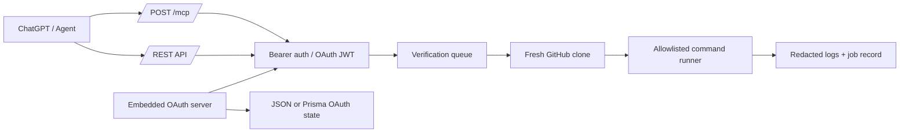

# Purr Verify MCP

<p align="center">
  
</p>

<p align="center">
  <strong>Self-hosted verification runner for coding agents, ChatGPT MCP, and CI-like live proof.</strong>
</p>

<p align="center">
  
  
  
  
  
</p>

---

## What this is

Purr Verify MCP gives agents a real runtime.

When an agent can edit code through GitHub MCP but cannot install dependencies, run tests, or build the repo, Purr Verify clones the target branch into an isolated workspace and runs only allowlisted commands. The result is a redacted, auditable verification record exposed through MCP and REST.

```text
ChatGPT / Codex / Agent
  ├─ GitHub MCP         read/write repo, commit, PR
  └─ Purr Verify MCP    clone ref -> install -> test/build -> return logs
```

This branch also includes a hardened embedded OAuth server for ChatGPT MCP connectors.

---

## Status

```text
OAuth ChatGPT protocol:        ready
Authorization Code + PKCE:     ready
Resource-bound MCP tokens:     ready
Ed25519 / EdDSA JWT signing:   ready
JWKS endpoint:                 ready
Refresh-token rotation:        ready
Replay family revocation:      ready
Prisma storage mode:           runtime-tested
Production build:              green
```

Verified head for this production OAuth hardening branch:

```text
1c5d9383ca87468c8206a075f4bb81d3dc4ebbb0
```

---

## Table of contents

- [Architecture](#architecture)
- [Quickstart](#quickstart)
- [ChatGPT OAuth setup](#chatgpt-oauth-setup)
- [Production environment](#production-environment)
- [Storage modes](#storage-modes)
- [Auth modes](#auth-modes)
- [MCP tools](#mcp-tools)
- [REST API](#rest-api)
- [Allowed commands](#allowed-commands)
- [Security model](#security-model)
- [Deployment notes](#deployment-notes)
- [Troubleshooting](#troubleshooting)

---

## Architecture



Runtime rules:

- No arbitrary shell execution.
- Commands are parsed and spawned with `shell: false`.
- Every job gets a clean workspace outside the app bundle.
- Job env values are redacted and never persisted.
- OAuth refresh credentials are stored only as SHA-256 hashes.

---

## Quickstart

```bash
git clone https://github.com/0xheycat/Purr-Verify-MCP.git
cd Purr-Verify-MCP
cp .env.example .env
bun install --frozen-lockfile
bun run dev
```

Health check:

```bash
curl http://localhost:3000/api/health
```

MCP endpoint:

```text
http://localhost:3000/mcp
```

Production endpoint shape:

```text
https://verify.yourdomain.com/mcp
```

---

## ChatGPT OAuth setup

ChatGPT should discover OAuth through these metadata routes:

```text
/.well-known/oauth-authorization-server
/.well-known/oauth-protected-resource
/.well-known/oauth-protected-resource/mcp
/.well-known/openid-configuration
```

OAuth endpoints:

```text
/oauth/authorize
/oauth/exchange
/oauth/register
/oauth/keys
/oauth/revoke
```

Supported OAuth behavior:

```text
Authorization Code + PKCE S256
Dynamic Client Registration
RFC 8707 resource binding
Ed25519 / EdDSA signed access tokens
Public JWKS with kid
Opaque refresh credentials
Refresh rotation on every use
Replay detection with family revocation
Scope narrowing on refresh
Token revocation endpoint
```

ChatGPT connector target:

```text
https://verify.yourdomain.com/mcp
```

The OAuth approval page is owner-gated with `OAUTH_OWNER_CODE`. Keep that value private.

---

## Production environment

Copy `.env.example` to `.env`, then set the values below. Secret values are intentionally left blank in this README so scanners do not mistake documentation for committed secrets.

### Minimum production env

```bash
NODE_ENV=production

PUBLIC_BASE_URL=https://verify.yourdomain.com
OAUTH_ISSUER=https://verify.yourdomain.com
OAUTH_RESOURCE_URL=https://verify.yourdomain.com/mcp

VERIFY_TOKEN=
GITHUB_TOKEN=
AUTH_MODE=server_token
ALLOWED_REPOS=0xheycat/Purr-Verify-MCP

OAUTH_OWNER_CODE=
OAUTH_PRIVATE_KEY=
OAUTH_ACTIVE_KEY_ID=prod-ed25519-2026-07
OAUTH_CLIENT_ID=chatgpt-purr-verify
OAUTH_SCOPES_SUPPORTED=verify:read verify:run verify:share
OAUTH_TOKEN_TTL_SECONDS=900
OAUTH_REFRESH_TOKEN_TTL_SECONDS=2592000
OAUTH_SUBJECT=0xheycat

OAUTH_STORAGE_MODE=json
VERIFY_DATA_DIR=/var/lib/purr-verify/data
WORKDIR_BASE=/var/lib/purr-verify/workspaces

MAX_CONCURRENT_JOBS=1
COMMAND_TIMEOUT_MS=600000
JOB_TIMEOUT_MS=1800000
CLEANUP_AFTER_MS=3600000
MAX_LOG_BYTES=500000
```

### Optional OAuth env

```bash
OAUTH_PUBLIC_KEY=
OAUTH_ALLOWED_REDIRECT_URIS=https://chatgpt.com/connector/oauth/callback
OAUTH_VERIFICATION_PUBLIC_KEYS=
```

`OAUTH_ALLOWED_REDIRECT_URIS` is recommended once the exact ChatGPT callback URI is known. During first live handshake, leaving it empty lets the predefined ChatGPT client accept callbacks under:

```text
https://chatgpt.com/connector/oauth/
```

Do not enable this in production:

```bash
OAUTH_ALLOW_EPHEMERAL_KEYS=true
```

That flag is only for local tests. Production must use a stable `OAUTH_PRIVATE_KEY`, otherwise existing tokens become invalid after restart.

### Generate an Ed25519 OAuth keypair

```bash
openssl genpkey -algorithm ED25519 -out oauth-ed25519-private.pem
openssl pkey -in oauth-ed25519-private.pem -pubout -out oauth-ed25519-public.pem
```

Paste the private PEM into `OAUTH_PRIVATE_KEY`. In hosted env UIs, use escaped newlines if multiline values are not supported.

---

## Storage modes

### JSON mode

Good for one active instance.

```bash
OAUTH_STORAGE_MODE=json
VERIFY_DATA_DIR=/var/lib/purr-verify/data
```

OAuth state is stored under:

```text
VERIFY_DATA_DIR/oauth/state.json
```

Use a persistent volume. Do not run multiple active app instances against the same local JSON file.

### Prisma mode

Good for transactional OAuth state.

```bash
OAUTH_STORAGE_MODE=prisma
DATABASE_URL=file:/var/lib/purr-verify/data/purr-verify.db
```

Prisma mode has runtime tests for:

- authorization-code consumption
- refresh credential rotation
- replay-family revocation
- simultaneous refresh race handling
- explicit revocation

Current schema provider is SQLite. For true horizontal multi-instance production, migrate the Prisma datasource to Postgres and use a shared transactional database.

---

## Auth modes

### `server_token`

Client uses the service token. Server uses `GITHUB_TOKEN` for private repo clone.

```bash
AUTH_MODE=server_token
VERIFY_TOKEN=
GITHUB_TOKEN=
```

### `github_passthrough`

Client bearer value is a GitHub credential. The server validates it against GitHub and uses it only in memory for clone.

```bash
AUTH_MODE=github_passthrough
ALLOWED_REPOS=*
ALLOW_ALL_REPOS=true
```

For ChatGPT OAuth, `server_token` is usually easier: ChatGPT receives an OAuth access token from this server, while the server clones private repos with its own `GITHUB_TOKEN`.

---

## MCP tools

| Tool | Purpose | Scope |
|---|---|---|
| `create_verification_job` | Clone repo/ref and run allowlisted commands | `verify:run` |
| `get_verification_job` | Read one job result | `verify:read` |
| `list_verification_jobs` | List recent jobs | `verify:read` |
| `cancel_verification_job` | Cancel queued/running job | `verify:run` |
| `list_allowed_commands` | Show allowed command grammar | `verify:read` |
| `health_check` | Health/runtime status | `verify:read` |
| `create_share_link` | Create temporary public job link | `verify:share` |
| `list_share_links` | List active share links | `verify:read` |
| `revoke_share_links` | Revoke share links | `verify:share` |
| `read_operating_guide` | Agent operating guide | `verify:read` |

Heavy jobs should use async mode and then poll `get_verification_job`.

```json
{
  "repo": "0xheycat/Purr-Verify-MCP",
  "ref": "fix/production-oauth-hardening",
  "expected_head": "1c5d938",
  "mode": "async",
  "commands": [
    "bun install --frozen-lockfile",
    "bunx prisma generate",
    "bun test",
    "bun run typecheck",
    "bun run lint",
    "bun run build"
  ]
}
```

---

## REST API

```bash
curl https://verify.yourdomain.com/api/health
```

Create verification job:

```bash
curl -X POST https://verify.yourdomain.com/api/verify \
  -H "Authorization: Bearer <value>" \
  -H "Content-Type: application/json" \
  -d '{
    "repo":"0xheycat/Purr-Verify-MCP",
    "ref":"main",
    "commands":["bun install --frozen-lockfile","bun run build"]
  }'
```

Poll job:

```bash
curl -H "Authorization: Bearer <value>" \
  https://verify.yourdomain.com/api/verify/<jobId>
```

---

## Allowed commands

Call `list_allowed_commands` for the live list. Current grammar includes:

```text
bun install
bun install --frozen-lockfile
bunx prisma generate
bunx prisma db push <safe-flags>
bun run <script>
bun run <script> <safe-flags>
bun test
bun test <path>
npm ci
npm run <script>
pnpm install --frozen-lockfile
pnpm run <script>
npx prisma generate
npx prisma db push <safe-flags>
node --version
node <safe-relative-path>
cat reports/<file>.json
cat reports/<file>.txt
```

Rejected everywhere:

```text
shell metacharacters
absolute paths
path traversal
arbitrary git URLs
sudo / docker / ssh / scp / rm / chmod / chown / powershell / nc / dd
```

---

## Security model

- OAuth access tokens are resource-bound to `/mcp`.
- Access tokens are signed with Ed25519/EdDSA and published through JWKS.
- Refresh credentials are opaque and stored only as SHA-256 hashes.
- Refresh credentials rotate on every use.
- Replayed refresh credentials revoke the full family.
- Authorization codes are single-use and survive restart through the selected storage backend.
- GitHub credentials are never persisted.
- Job env values are redacted from logs and share links.
- Commands run without shell expansion.
- Workspaces are isolated and cleaned after jobs.

---

## Deployment notes

### Single instance

Use this for the current production path:

```text
1 VPS / 1 container / 1 active app instance
```

Recommended env:

```bash
OAUTH_STORAGE_MODE=json
VERIFY_DATA_DIR=/var/lib/purr-verify/data
WORKDIR_BASE=/var/lib/purr-verify/workspaces
MAX_CONCURRENT_JOBS=1
```

### Multi-instance

Use this only when you run multiple app servers behind a load balancer.

```text
Load balancer
  ├─ app instance A
  ├─ app instance B
  └─ app instance C
```

Multi-instance requires shared transactional storage. Do not use local JSON state for this. Move Prisma to Postgres first.

---

## Verification checklist

Before calling a deployment production-ready:

```bash
bun install --frozen-lockfile
bunx prisma generate
bun test
bun run typecheck
bun run lint
bun run build
```

For OAuth storage proof:

```bash
bun test src/lib/verify/oauth-server.test.ts
bun test src/lib/verify/oauth-prisma-state.test.ts
```

Expected behavior:

```text
OAuth tests pass
Prisma runtime proof passes
Typecheck passes
Lint passes
Next production build passes
```

---

## Troubleshooting

### ChatGPT cannot authorize

Check:

```text
PUBLIC_BASE_URL
OAUTH_ISSUER
OAUTH_RESOURCE_URL
OAUTH_OWNER_CODE
OAUTH_PRIVATE_KEY
OAUTH_ACTIVE_KEY_ID
```

Then open:

```text
https://verify.yourdomain.com/.well-known/oauth-authorization-server
https://verify.yourdomain.com/.well-known/oauth-protected-resource/mcp
https://verify.yourdomain.com/oauth/keys
```

### Token exchange fails with `invalid_target`

`resource` does not match `OAUTH_RESOURCE_URL`. For ChatGPT MCP this should usually be:

```text
https://verify.yourdomain.com/mcp
```

### Tokens become invalid after restart

You are probably using ephemeral keys. Set a stable `OAUTH_PRIVATE_KEY` and `OAUTH_ACTIVE_KEY_ID`.

### Authorization code works once then fails

That is expected. Authorization codes are single-use.

### Refresh token replay revokes access

That is expected. Reusing an already-rotated refresh credential is treated as replay and revokes the full family.

### Build fails only inside the runner

Check `/api/health`. `workspaceRoot` must not be inside `.next`. Use:

```bash
WORKDIR_BASE=/var/lib/purr-verify/workspaces
```

---

## Project files

```text
src/lib/verify/oauth-server.ts          OAuth endpoints + token exchange
src/lib/verify/oauth-keys.ts            Ed25519 signing, JWKS, key rotation support
src/lib/verify/oauth-state.ts           JSON / Prisma OAuth state backend
src/lib/verify/oauth-metadata.ts        Protected-resource metadata
src/lib/verify/auth.ts                  Bearer, OAuth JWT, GitHub passthrough auth
src/lib/verify/mcp.ts                   MCP tools and scope enforcement
prisma/schema.prisma                    OAuth storage tables
SPEC.md                                 Product boundary and acceptance criteria
SKILL.md                                Agent operating guide
```

---

## License

MIT
