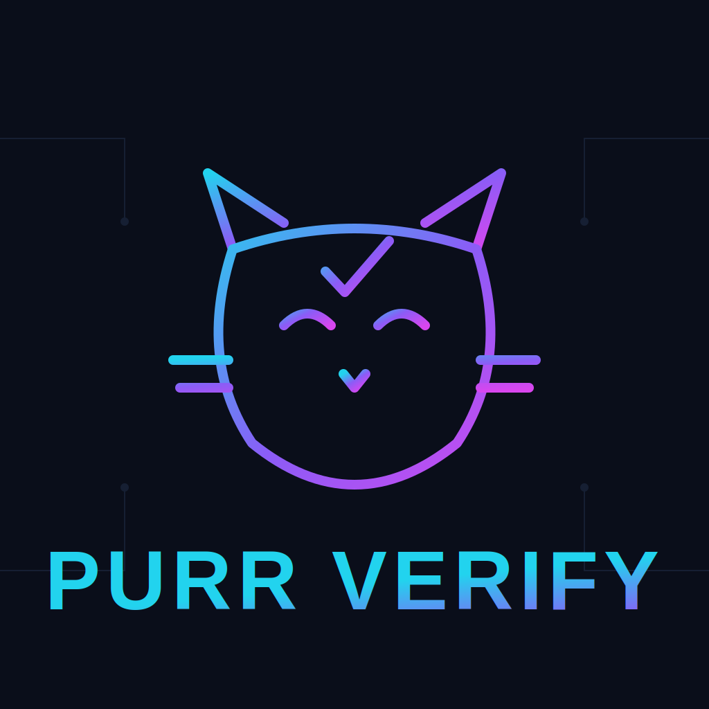
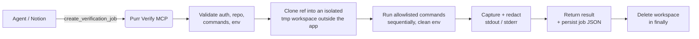

# 🐾 Purr Verify MCP

<p align="center">
  
</p>

> **Live-verification runtime for coding agents.** When your agent can *write* code (via GitHub MCP) but can't *run* it, Purr Verify clones the branch, runs an allowlisted build/test set in a **clean, isolated workspace**, redacts secrets, and hands back **trustworthy logs** — over MCP or REST.

    

---

## Table of contents

- [Why this exists](#why-this-exists)
- [How it works](#how-it-works)
- [Quickstart (5 minutes)](#quickstart-5-minutes)
- [Using it from an agent (MCP)](#using-it-from-an-agent-mcp)
- [Using it over REST](#using-it-over-rest)
- [Tool reference](#tool-reference)
- [Passing secrets with `env`](#passing-secrets-with-env)
- [Command allowlist](#command-allowlist)
- [Recent update — runner environment hardening](#recent-update--runner-environment-hardening)
- [Configuration](#configuration)
- [Auth modes](#auth-modes)
- [Deploy (self-hosting)](#deploy-self-hosting)
- [Security model](#security-model)
- [Troubleshooting](#troubleshooting)
- [For agents: `SKILL.md`](#for-agents-skillmd)
- [License](#license)

---

## Why this exists

Coding agents often run in a sandbox with **no internet, no `node_modules`, and no ability to run a real build or test suite**. They can read and edit a repo through a GitHub MCP, but they can't *prove* the change actually compiles or passes tests.

Purr Verify is the missing runtime. It is **not** a general shell — every command is matched against an allowlist and executed with `spawn(..., { shell: false })`.

**Use it when:**

- The agent sandbox has no network or dependencies installed.
- GitHub Actions is unavailable, disabled, or billing-blocked.
- You need live proof of `bun install`, `bun test`, `bun run build`, `bunx prisma generate`, or a project smoke script.
- You want a single MCP tool Notion/agents can call to get a green/red answer with logs.

```text
Agent / Notion
  ├─▶ GitHub MCP        read/write repo, open PRs, commit
  └─▶ Purr Verify MCP   clone branch → install → build/test → return logs
```

---

## How it works

Every job is a fresh, isolated lifecycle. Nothing persists between jobs except the redacted result record.



**Step by step:**

1. **Validate** — bearer auth is checked; `repo` must match `owner/repo` and be allowed; `ref`/`expected_head` are format-checked; every command is matched against the allowlist; any `env` keys/values are validated.
2. **Clone** — the ref is cloned fresh into `<os.tmpdir()>/purr-verify-workspaces/<jobId>-<hash>/` (an isolated root **outside** the app bundle — see [the recent update](#recent-update--runner-environment-hardening)).
3. **Run** — commands run **sequentially** in the clean workspace. `continue_on_error` decides whether a failure stops the chain. Each command is subject to `COMMAND_TIMEOUT_MS`; the whole job to `JOB_TIMEOUT_MS`.
4. **Capture + redact** — stdout/stderr are captured (capped at `MAX_LOG_BYTES`) and scrubbed of known secret/token patterns *and* any values you passed via `env`.
5. **Return** — `sync` mode returns the full final job inline; `async` mode returns a `jobId` you poll. Finished jobs are persisted best-effort under `.verify-data`.
6. **Cleanup** — the workspace is deleted in a `finally` block regardless of outcome.

### `sync` vs `async`

| | `sync` | `async` (default) |
|---|---|---|
| Returns | Full final job in one call | `jobId` + `statusUrl` immediately |
| Best for | Short/medium jobs (a single `bun install`, a quick test) | Heavy jobs (install + build + full test suite) |
| Caveat | Blocks until done — bounded by the MCP transport window (~60s) | Poll `get_verification_job` until `status` is terminal |

> **Rule of thumb:** if a job does install **and** build **and** test, use `async`. Sync calls that exceed the transport window will time out at the client even though the job keeps running.

---

## Quickstart (5 minutes)

### 1. Point your MCP client at the server

```text
MCP URL:  https://<your-host>/mcp
Auth:     Bearer token
Token:    <your GitHub PAT>     # in github_passthrough mode
```

> Don't have a host yet? See [Deploy (self-hosting)](#deploy-self-hosting) — there is no shared public URL; you run your own instance.

### 2. Confirm the runtime is healthy

Call `health_check`. You should see the runtime versions and — importantly — a `workspaceRoot` that lives under the OS temp dir (not inside `.next`):

```json
{
  "status": "ok",
  "authMode": "github_passthrough",
  "nodeVersion": "v26.3.0",
  "bunVersion": "1.3.14",
  "workspaceRoot": "/tmp/purr-verify-workspaces"
}
```

### 3. Discover what you can run

Call `list_allowed_commands` to see the exact command grammars this runner accepts.

### 4. Verify a branch

```json
{
  "name": "create_verification_job",
  "arguments": {
    "repo": "0xheycat/Purrliquid",
    "ref": "main",
    "mode": "async",
    "commands": ["bun install", "bunx prisma generate", "bun run ci:check", "bun test"]
  }
}
```

Then poll `get_verification_job` with the returned `jobId` until `status` is `success` or `failed`.

---

## Using it from an agent (MCP)

The MCP endpoint speaks JSON-RPC 2.0 at `POST /mcp` and supports `initialize`, `tools/list`, and `tools/call`.

**Sync example — one call, final result:**

```json
{
  "jsonrpc": "2.0",
  "id": 1,
  "method": "tools/call",
  "params": {
    "name": "create_verification_job",
    "arguments": {
      "repo": "0xheycat/Purrliquid",
      "ref": "main",
      "mode": "sync",
      "commands": ["bun install"],
      "metadata": { "purpose": "smoke" }
    }
  }
}
```

**Async example — queue then poll:**

```json
{ "jsonrpc": "2.0", "id": 2, "method": "tools/call",
  "params": { "name": "create_verification_job",
    "arguments": { "repo": "0xheycat/Purrliquid", "ref": "pre-launch",
      "expected_head": "399d150",
      "commands": ["bun install", "bunx prisma generate", "bun run ci:check", "bun test"] } } }
```

```json
{ "jsonrpc": "2.0", "id": 3, "method": "tools/call",
  "params": { "name": "get_verification_job", "arguments": { "jobId": "<jobId-from-above>" } } }
```

> `initialize` and `tools/list` are open; **`tools/call` requires the bearer token** because it can mutate state.

---

## Using it over REST

```bash
# Health (no auth)
curl https://<host>/api/health

# Diagnostics — reports auth mode, repo mode, runtime tools, allowlist,
# and sample validations. Does NOT execute repo commands.
curl -H "Authorization: Bearer $TOKEN" https://<host>/api/smoke

# Sync verification — one call, full final result
curl -X POST "https://<host>/api/verify?mode=sync" \
  -H "Authorization: Bearer $TOKEN" \
  -H "Content-Type: application/json" \
  -d '{"repo":"0xheycat/Purrliquid","ref":"main","commands":["bun install"]}'

# Async verification — returns a jobId
curl -X POST "https://<host>/api/verify" \
  -H "Authorization: Bearer $TOKEN" \
  -H "Content-Type: application/json" \
  -d '{"repo":"0xheycat/Purrliquid","ref":"main","commands":["bun install"]}'

# Poll a job
curl -H "Authorization: Bearer $TOKEN" https://<host>/api/verify/<jobId>
```

---

## Tool reference

| Tool | Purpose | Read-only |
|---|---|:---:|
| `create_verification_job` | Clone a repo/ref and run allowlisted commands (`sync` or `async`) | ✗ |
| `get_verification_job` | Fetch full status + result of a job by `jobId` | ✓ |
| `list_verification_jobs` | List recent jobs (most recent first) | ✓ |
| `cancel_verification_job` | Cancel a queued/running job | ✗ |
| `list_allowed_commands` | List the exact allowlisted command grammars | ✓ |
| `health_check` | Health, job counts, runtime versions, `workspaceRoot` | ✓ |
| `create_share_link` | Temporary public read-only link to a finished job | ✗ |
| `list_share_links` | List active share links for a job | ✓ |
| `revoke_share_links` | Revoke all share links for a job | ✗ |

### `create_verification_job` arguments

| Field | Type | Required | Notes |
|---|---|:---:|---|
| `repo` | string | ✓ | `owner/repo` slug only. Cloned from `https://github.com/<owner>/<repo>.git`. Arbitrary URLs are never accepted. |
| `ref` | string | ✓ | Branch or tag. |
| `commands` | string[] | ✓ | Allowlisted commands, run in order. |
| `expected_head` | string | ✗ | Short or full SHA (4–40 hex) to assert the checked-out HEAD. |
| `mode` | `sync` \| `async` | ✗ | Default `async`. |
| `continue_on_error` | boolean | ✗ | Default `false` — stop at the first failing command. |
| `env` | object (string→string) | ✗ | Per-job env injection, redacted from all output. See below. |
| `tags` | string[] | ✗ | Up to 10, 1–30 chars, `[a-zA-Z0-9_-]`. |
| `callback_url` | string | ✗ | HTTPS URL POSTed a `{event,jobId,status,...}` payload on finish. |
| `metadata` | object | ✗ | Free-form; echoed back on the job. |

**Treat as verified when** `status: "success"` **and** `cleanupStatus: "done"`, then report each command's `exitCode` / `stdout` / `stderr`.

---

## Passing secrets with `env`

Some builds/tests need environment variables (API base URLs, feature flags, tokens). Pass them via `env` on `create_verification_job`:

```json
{
  "name": "create_verification_job",
  "arguments": {
    "repo": "0xheycat/Purrliquid",
    "ref": "main",
    "commands": ["bun install", "bun test"],
    "env": {
      "APP_BASE_URL": "https://staging.example.com",
      "FEATURE_X": "1",
      "SOME_TOKEN": "abcd1234efgh5678"
    }
  }
}
```

**Guarantees:**

- Values are injected into **every** command's process environment.
- Values are **redacted** (`***REDACTED***`) from stored logs, results, and share links.
- Values are **never persisted** to disk.
- **Reserved keys are rejected** so a job can never repoint module/library resolution: `PATH`, `NODE_PATH`, `NODE_OPTIONS`, `LD_PRELOAD`, `LD_LIBRARY_PATH`, `DYLD_INSERT_LIBRARIES`.
- Limits: keys must match `^[A-Za-z_][A-Za-z0-9_]*$`, values are strings ≤ 4096 chars, max 50 vars.

---

## Command allowlist

Call `list_allowed_commands` for the live list. The grammars are:

```text
bun install
bun install --frozen-lockfile
bunx prisma generate
bun run <script>
bun test
bun test <path>
npm ci
npm run <script>
pnpm install --frozen-lockfile
pnpm run <script>
npx prisma generate
node <safe-relative-path>
cat reports/<file>.json
cat reports/<file>.txt
ENV_MODE=mock bun run scripts/manage.ts <safe-flags>
```

Rejected everywhere (parsed, not shelled):

```text
; && || | > < ` $() .. \ " '
curl wget rm mv cp sudo chmod chown ssh scp docker powershell nc mkfs dd
absolute paths · arbitrary git URLs
```

> **Tip:** for a Prisma project, put `bunx prisma generate` **after** `bun install` and **before** the build/test step.

---

## Recent update — runner environment hardening

> Shipped in [PR #1](https://github.com/0xheycat/Purr-Verify-MCP/pull/1). This fixed a class of **false-negative** build/test failures that came from the *runner*, not the code under test.

### The bug

Two signatures showed up on refs that were known-green in real CI:

1. `next build` → `TypeError: generate is not a function`
2. `bun test` → 13 failures + 2 file-load errors in Solana modules (`@solana/web3.js` named exports not found)

### Root cause

Per-job clones were staged under `WORKDIR_BASE`, resolved against `process.cwd()`. In production the server runs as `bun .next/standalone/server.js`, so `cwd` is **inside the Next build output** and clones landed at:

```text
.next/standalone/.verify-workspaces/<jobId>-<hash>/…
```

Nesting a clone *inside the server's own bundle* poisons module resolution — bun/node walk up the tree and resolve packages like `@solana/web3.js` against the bundle's `node_modules` (wrong CJS entry) — and clean build prep never runs. The result was reproducible false failures.

### What changed

| Area | Change |
|---|---|
| **Isolated workspace** | `workdirBase` now defaults to `<os.tmpdir()>/purr-verify-workspaces`. A `resolveWorkdirBase()` + `isInsideNextBuild()` guard relocates any `.next`-nested path to temp. Each job gets a clean per-job `node_modules`. |
| **Clean module resolution** | Repo commands run with `NODE_PATH` / `NODE_OPTIONS` stripped, so resolution is driven purely by the isolated workspace. |
| **`env` injection** | First-class, redacted, non-persisted per-job env (see above). |
| **Observability** | `health_check` now reports `nodeVersion`, `bunVersion`, and the resolved `workspaceRoot`; new `list_allowed_commands` tool exposes the allowlist grammar. |
| **Timeouts** | Defaults already generous (`JOB_TIMEOUT_MS`=30m, `COMMAND_TIMEOUT_MS`=10m); guidance added to prefer `async` for heavy jobs due to the ~60s sync transport window. |

Security posture was preserved and, for secrets, **strengthened** (per-job env values are now scrubbed too). The tool contract stays **backward-compatible**: `env` is optional and the new tool/health fields are additive.

---

## Configuration

| Var | Default | Notes |
|---|---|---|
| `AUTH_MODE` | `server_token` | `server_token` or `github_passthrough` |
| `VERIFY_TOKEN` | empty | Required only in `server_token` mode |
| `GITHUB_TOKEN` | empty | Optional clone token in `server_token` mode |
| `ALLOWED_REPOS` | empty | Empty or `*` = unrestricted safe `owner/repo` mode |
| `ALLOW_ALL_REPOS` | `false` | Force unrestricted safe repo mode |
| `WORKDIR_BASE` | `<os.tmpdir()>/purr-verify-workspaces` | Per-job clone root. **Relative or `.next`-nested values are relocated to temp** (see recent update). |
| `VERIFY_DATA_DIR` | `.verify-data` | Finished-job JSON persistence |
| `MAX_LOG_BYTES` | `500000` | Per-command stdout/stderr cap |
| `COMMAND_TIMEOUT_MS` | `600000` | Per-command timeout (10m) |
| `JOB_TIMEOUT_MS` | `1800000` | Whole-job timeout (30m) |
| `MAX_CONCURRENT_JOBS` | `1` | Keep `1` on free hosts |
| `CLEANUP_AFTER_MS` | `3600000` | Cleanup hint |

---

## Auth modes

### `github_passthrough` (recommended for agents)

```bash
AUTH_MODE=github_passthrough
ALLOWED_REPOS=*
ALLOW_ALL_REPOS=true
```

Client sends `Authorization: Bearer <GitHub PAT>`. The server validates the PAT via `GET https://api.github.com/user`, caches validation by token hash for 5 minutes, uses it in memory for `git clone`, **never persists it**, and redacts token patterns from logs.

### `server_token`

```bash
AUTH_MODE=server_token
VERIFY_TOKEN=<random service token>
GITHUB_TOKEN=<optional GitHub PAT for private clone>
```

Client sends `Authorization: Bearer <VERIFY_TOKEN>`.

---

## Deploy (self-hosting)

> **There is no shared public Purr Verify URL.** The GitHub MCP we rely on is already a hosted/public service, but the **verification runner is something you host yourself** — one small instance per person or team. Once it's online with an HTTPS URL, point your MCP client at `https://<your-host>/mcp`.

You need any host that can (1) run Bun, (2) reach `github.com`, and (3) expose an **HTTPS** port. Below are free/cheap options, easiest first, plus how to get a public URL.

### Option A — Render (easiest, zero server admin)

Deploy as a **Web Service** (not Static Site). This repo ships a `render.yaml` blueprint, so you can “New → Blueprint” and point it at your fork.

```bash
# Build Command
bun install --frozen-lockfile && bun run build
# Start Command
bun run start
```

Blueprint defaults: `AUTH_MODE=github_passthrough`, `ALLOWED_REPOS=*`, `ALLOW_ALL_REPOS=true`, `MAX_CONCURRENT_JOBS=1`. Render gives you an automatic `https://<app>.onrender.com` URL → your MCP endpoint is that + `/mcp`.

> Free instances **sleep when idle** (first request cold-starts) and offer ~750 hrs/month. Fine for occasional verification; use Option B for always-on.

### Option B — Oracle Cloud **Always Free** (most generous — a real always-on VM)

Oracle Cloud's **Always Free** tier includes Arm Ampere (A1) VMs (up to 4 vCPU / 24 GB RAM) that **don't expire** — ideal for an always-on runner. Rough steps:

1. Create an **Always Free** Ampere (ARM) Compute instance, Ubuntu 22.04+.
2. In the VCN **Security List / NSG**, add ingress rules for TCP **443** (and **80** for certificate issuance).
3. SSH in and install Bun + git:
   ```bash
   sudo apt update && sudo apt install -y git unzip
   curl -fsSL https://bun.sh/install | bash && source ~/.bashrc
   ```
4. Clone, configure, and build:
   ```bash
   git clone https://github.com/0xheycat/Purr-Verify-MCP.git
   cd Purr-Verify-MCP
   cp .env.example .env    # set AUTH_MODE=github_passthrough, ALLOW_ALL_REPOS=true
   bun install --frozen-lockfile && bun run build
   ```
5. Run it under **systemd** so it survives reboots (a unit that runs `bun run start`, listening on port 3000).
6. Put **Caddy** in front for **automatic HTTPS** (needs a domain’s A record pointed at the VM’s public IP):
   ```caddy
   # /etc/caddy/Caddyfile
   verify.yourdomain.com {
     reverse_proxy localhost:3000
   }
   ```
   Caddy fetches a Let’s Encrypt cert automatically → your MCP URL becomes `https://verify.yourdomain.com/mcp`.

> Don’t forget Ubuntu’s local firewall too: `sudo ufw allow 80,443/tcp`. No domain? Use Option D (Cloudflare Tunnel) to get HTTPS without one.

### Option C — Fly.io / Railway / Google Cloud Run (container-native)

All three have free or trial tiers and hand you an HTTPS URL out of the box. Bun + the Next.js standalone build runs well in a container: set the same env vars, expose port **3000**, and use the platform domain (`*.fly.dev`, `*.up.railway.app`, `*.run.app`) as your MCP host. Cloud Run in particular scales to zero, so you only pay/consume while a job runs.

### Option D — Any VPS or your own machine + **Cloudflare Tunnel** (no public IP needed)

If your host has **no public IP** (home server, NAT, locked-down cloud), run the app locally and expose it with a free **Cloudflare Tunnel** (or `ngrok`):

```bash
bun run start                              # app on http://localhost:3000
cloudflared tunnel --url http://localhost:3000
```

Cloudflare prints a public HTTPS URL (e.g. `https://something.trycloudflare.com`) → your MCP endpoint is that URL + `/mcp`. This is the fastest way to get a shareable HTTPS URL without opening firewall ports or owning a domain.

### Which should I pick?

| Option | Cost | Always-on | HTTPS | Best for |
|---|---|---|---|---|
| **Render** | Free tier | Sleeps when idle | Automatic | Fastest setup, no server admin |
| **Oracle Cloud Always Free** | Free (no expiry) | Yes | Caddy + domain | A real always-on runner |
| **Fly.io / Railway / Cloud Run** | Free/trial | Varies (Cloud Run scales to zero) | Automatic | Container-native deploys |
| **VPS/home + Cloudflare Tunnel** | Free | While the machine is up | Automatic (tunnel) | No public IP / quick sharing |

### After it's up

1. `curl https://<your-host>/api/health` → expect `status: "ok"` and a `workspaceRoot` under the OS temp dir (not `.next/...`).
2. Point your MCP client at `https://<your-host>/mcp` with `Authorization: Bearer <GitHub PAT>` (in `github_passthrough` mode).
3. Keep `MAX_CONCURRENT_JOBS=1` on small/free instances.

### Local development

```bash
cp .env.example .env
bun install
bun run dev          # http://localhost:3000
bun run check        # typecheck + lint + build
```

---

## Security model

- Bearer auth on protected endpoints and every `tools/call`.
- GitHub PAT passthrough for private repos; raw tokens are **never persisted**.
- Repo input is only `owner/repo` (path-traversal segments rejected); clone target is always `https://github.com/<owner>/<repo>.git`.
- **No shell execution** — `spawn(..., { shell: false })` with an allowlist.
- Workspaces are isolated **outside** the app bundle, fresh per job, deleted in `finally`.
- Injected `env` cannot repoint module/library resolution (reserved keys blocked).
- stdout/stderr redaction for common secret/token patterns **and** any provided `env` values.
- One concurrent job by default.

---

## Troubleshooting

**`next build` fails with `TypeError: generate is not a function`, or `bun test` can't find `@solana/web3.js` exports — but CI is green.**
This was the runner environment bug fixed in [PR #1](https://github.com/0xheycat/Purr-Verify-MCP/pull/1). Confirm your deployment includes it: `health_check` should report a `workspaceRoot` under the OS temp dir (not `.next/...`). If it still points inside `.next`, unset any relative `WORKDIR_BASE` and redeploy.

If workspace isolation is already deployed and the failure is still identical, use the round-2 parity checks in [`docs/RUNNER_TOOLCHAIN_PARITY.md`](docs/RUNNER_TOOLCHAIN_PARITY.md). The runner now reports each job's effective Node/Bun versions, frozen install strategy, and optional package resolution probe output.

For public runners, set global fallbacks like `TOOLCHAIN_DEFAULT_NODE=26.3.0` and `TOOLCHAIN_DEFAULT_BUN=1.3.14` so repos without exact toolchain metadata still run under a predictable baseline. Jobs also emit `runnerRecommendations` when a repo should add `.nvmrc`, `packageManager`, or a lockfile for cleaner live verification.

For heavy repos, prefer split commands (`bun run typecheck`, `bun run lint`, `bun run build`, `bun test`) and set long runner limits such as `COMMAND_TIMEOUT_MS=1800000` and `JOB_TIMEOUT_MS=7200000`.

For fork/soak operations that need background Surfpool and multi-hour runtime,
use explicit long-run mode. See [docs/LONG_RUN_OPERATIONS.md](docs/LONG_RUN_OPERATIONS.md)
for the scoped command grammar, timeout cap, and loopback RPC payload format.

**`next build` fails with `spawn .../node ENOENT`.**
An external cleanup process removed a cached Node/Bun toolchain while the job was still using it. Keep toolchain cleanup idle-only (`activeJobs + queuedJobs == 0`) and avoid pruning freshly used toolchain directories. See [`docs/RUNNER_TOOLCHAIN_PARITY.md`](docs/RUNNER_TOOLCHAIN_PARITY.md#toolchain-cache-cleanup).

**A sync call times out but the job seems fine.**
Heavy jobs exceed the ~60s MCP transport window. Use `mode: "async"` and poll `get_verification_job`.

**A command is rejected before running.**
It doesn't match the allowlist. Call `list_allowed_commands` and adjust. Shell metacharacters and absolute paths are always rejected.

**Prisma client errors during build.**
Add `bunx prisma generate` after `bun install` and before build/test.

**First request is slow.**
Free hosts cold-start. Keep `MAX_CONCURRENT_JOBS=1` on small instances.

---

## For agents: `SKILL.md`

A ready-to-load agent skill lives in [`SKILL.md`](./SKILL.md). It tells an agent **when** to reach for Purr Verify, **which** tool to call, and gives copy-paste recipes for the common verification flows.

---

## License

MIT
